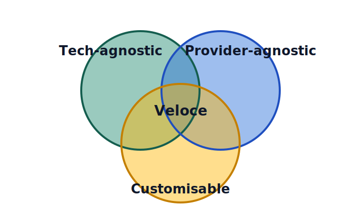

<pre align="center">
██╗   ██╗███████╗██╗      ██████╗  ██████╗███████╗
██║   ██║██╔════╝██║     ██╔═══██╗██╔════╝██╔════╝
██║   ██║█████╗  ██║     ██║   ██║██║     █████╗
╚██╗ ██╔╝██╔══╝  ██║     ██║   ██║██║     ██╔══╝
 ╚████╔╝ ███████╗███████╗╚██████╔╝╚██████╗███████╗
  ╚═══╝  ╚══════╝╚══════╝ ╚═════╝  ╚═════╝╚══════╝
</pre>

<h1 align="center">Veloce</h1>

  <b>Minimal AI-powered personal assistant that lives in your IDE.</b>

  
  
  

  <a href="https://veloce.dev/docs">Documentation</a>
  &nbsp;&nbsp;•&nbsp;&nbsp;
  <a href="https://github.com/NicoGrassetto/Veloce/issues">Issues</a>
  &nbsp;&nbsp;•&nbsp;&nbsp;
  <a href="https://github.com/NicoGrassetto/Veloce/issues?q=label%3Aroadmap">Roadmap</a>
   

---

# What is Veloce?

Veloce is a fast, lightweight, AI-powered command-line assistant. It ships as a single binary called `vel`.

  

It works **out of the box for $0** using local models — no API key required. When you need more power, plug in OpenAI, Anthropic, OpenRouter, or any OpenAI-compatible API. Bring your own provider, swap models on the fly, and keep full control over your setup.

## Background

In early spring 2026, my productivity hit an all-time high. I was heavily using a combination of Claude, Microsoft Copilot, Gemini, and ChatGPT in my day-to-day work, but it still was not feeling quite like I wanted it to.

I felt there was friction due to context switching. You see, switching from one tool to another, copy-pasting files and answers around, was the new roadblock in my productivity journey.

After a while, I found myself staying more and more within GitHub Copilot (or coding assistants more generally) because a coding assistant is all you need. It turns out that the paradigm we have converged to today (markdown, skills, agents as markdown, MCP, ...) is actually enough for most people, especially for a technical audience, because we have the advantage of full customisation.

So I built Veloce, merging most of my productivity tasks into this one repo template. I have been using it for a while now, and it is pretty good, so I thought I would share it. :)

Veloce means fast in Italian, which encompasses the spirit and values of this endeavor. Veloce works regardless of your productivity or tech stack and is meant to be customised.

# Getting started

### Contributing

Contributions are welcome! Veloce is community-driven and built in the open.

- Found a bug? [Open an issue](https://github.com/NicoGrassetto/Veloce/issues/new)
- Have an idea? [Start a discussion](https://github.com/NicoGrassetto/Veloce/issues/new)
- Want to contribute code? Fork the repo, make your changes, and open a PR

# Acknowledgements

Veloce builds on the excellent work of [Anthropic's skills](https://github.com/anthropics/skills/tree/main), which inspired the skill format and patterns used in this repo.

# License

AGPL-3.0 — see [LICENSE](LICENSE) for details.

Follow the [roadmap](https://github.com/NicoGrassetto/Veloce/issues?q=label%3Aroadmap) for updates.
