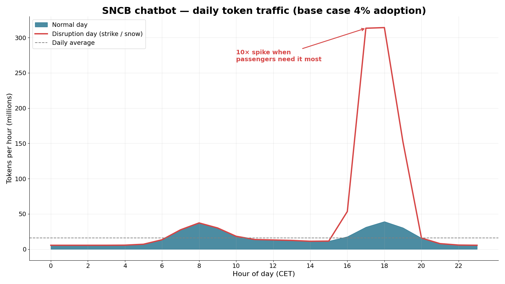
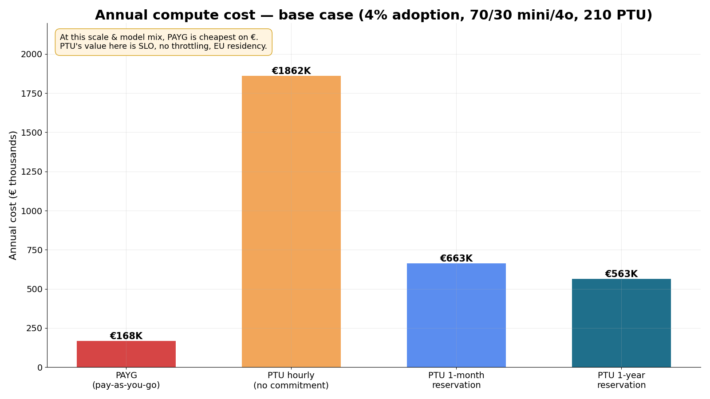
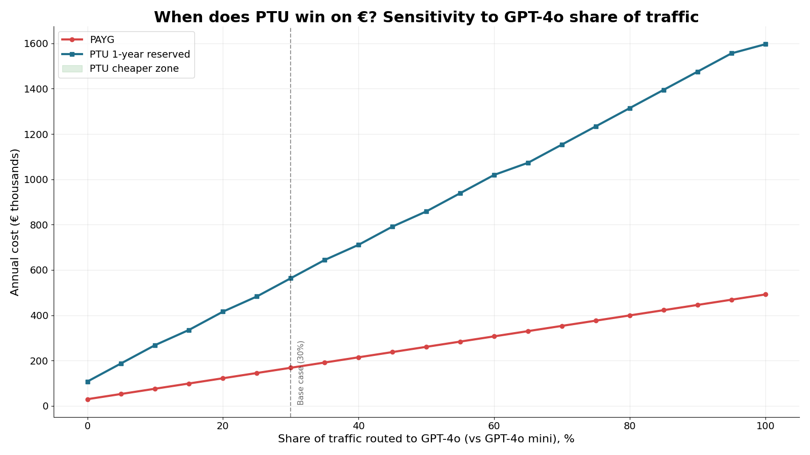
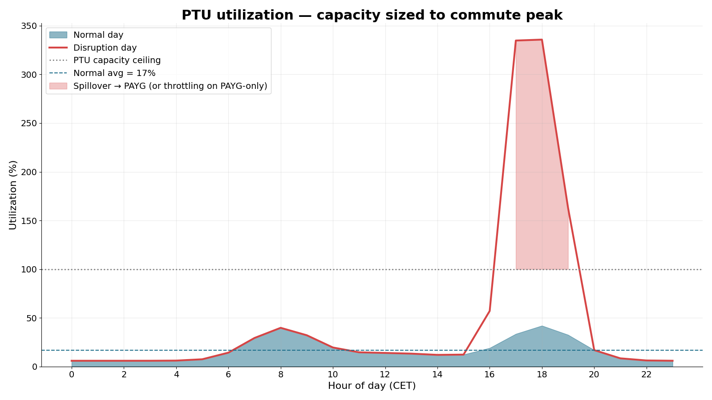
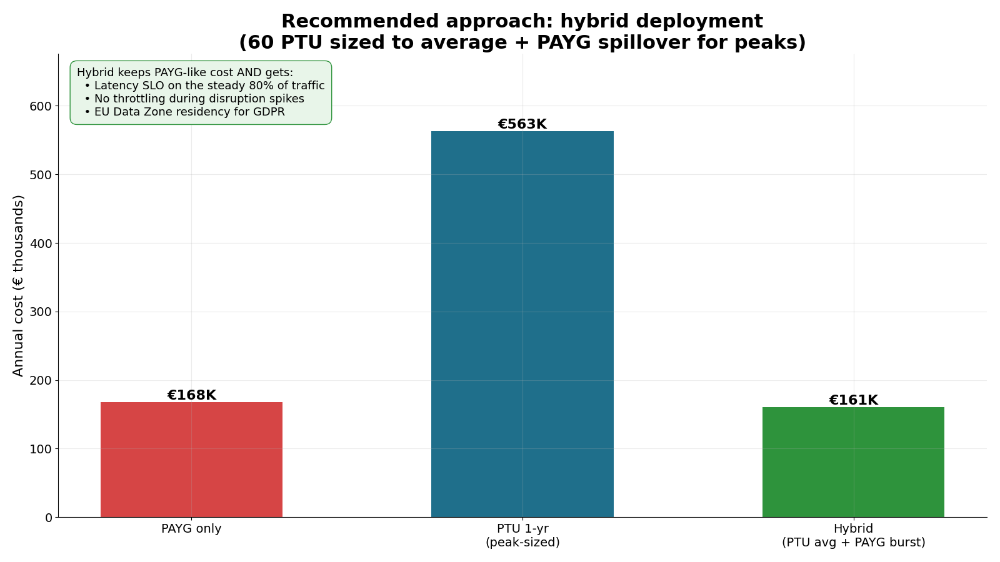
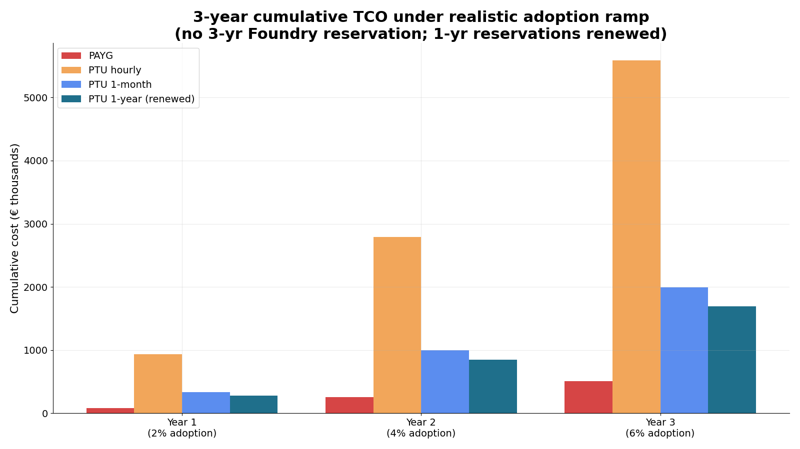

<!-- _paginate: false -->
<!-- _class: lead -->

# SNCB Passenger Chatbot
## Azure OpenAI — PTU vs Pay-As-You-Go

**A business case for Microsoft Foundry capacity, the honest way.**

Veloce · 27 May 2026

---

## Executive summary

- SNCB plans **GPT-4o / GPT-4o mini on PAYG** for the B2C passenger chatbot.
- On **pure €**, PAYG is cheaper at launch scale — the headline "switch to PTU and save" pitch does **not** hold at SNCB's projected volume.
- The real PTU case is **operational**: latency SLO, no 429 throttling during disruption spikes, EU Data Zone residency.
- **Recommendation: hybrid deployment** — PTU 1-yr reserved sized to *average* load + PAYG spillover for peaks. Same €, all the production-grade benefits.

Headline number, base case (4% adoption, 70/30 mini/4o): PAYG €168K/yr · PTU-1yr peak-sized €563K/yr · <b class="accent">Hybrid €161K/yr</b>.

---

<!-- _class: lead -->

# 1. What we're pricing

---

## The workload

- Customer: **SNCB / NMBS** — Belgian national railway, **225M journeys/year**.
- Channel: **B2C passenger chatbot** — travel info, ticket questions, **disruptions**, multilingual NL / FR / EN / DE.
- Architecture: **RAG over timetables + real-time disruption feed + FAQ**.
- Workhorse: **GPT-4o mini** (70%) · Escalation: **GPT-4o** (30%).
- Region: **EU Data Zone** (GDPR + Belgian public-sector posture).

| Parameter | Value |
|---|---|
| Adoption (base case, year 2) | 4% of journeys → **9.0 M sessions/yr** |
| Turns / session | 6 |
| Input tokens / turn (RAG-heavy) | 2,200 |
| Output tokens / turn | 350 |
| Peak / average multiplier | 4× (commute + disruptions) |

---

## Azure OpenAI EU Data Zone pricing — May 2026

| Mode | GPT-4o mini | GPT-4o |
|---|---|---|
| **PAYG** input / output (per 1M tok) | $0.165 / $0.66 | $2.75 / $11.00 |
| **PTU hourly** | $1.10 / PTU / hr | $1.10 / PTU / hr |
| **PTU 1-month reservation** | $286 / PTU / month | $286 / PTU / month |
| **PTU 1-year reservation** | $2,916 / PTU / yr (~70% off hourly) | same |

**Minimum deployment: 15 PTU** · No 3-year reservation exists for Foundry PTU — multi-year TCO rolls 1-year renewals.

Sources: Azure OpenAI pricing page; Microsoft Learn — *What is provisioned throughput*; Azure Reservations page (May 2026).

---

<!-- _class: lead -->

# 2. The traffic story

---

## Daily traffic — and the disruption tail

- Bimodal commuter pattern → 4× peak on a **normal** day.
- A **strike or snow day** lifts the evening peak to **10×** the daily average.
- This is exactly when passengers *need* the bot to respond.
- **PAYG capacity is shared & best-effort** — it 429s precisely during the moments that define customer trust.

---

<!-- _class: lead -->

# 3. The honest cost comparison

---

## Annual cost — base case

- **PAYG: €168K/yr** — cheapest on €.
- **PTU 1-yr reserved (peak-sized): €563K/yr** — 3.4× more expensive.
- Why: at this scale, GPT-4o mini's PAYG rate ($0.165 / 1M input) is so cheap that PTU's minimum 15-PTU deployment is over-provisioned.
- **We will not pretend otherwise to the customer.**

Cost = compute only. Excludes RAG storage, AI Search, network, observability.

---

## When *does* PTU win on €?

- Sensitivity: hold adoption at 4%, vary the **GPT-4o share** of traffic.
- PTU 1-yr **crosses below PAYG** once GPT-4o handles **~55%+** of turns.
- Rationale: GPT-4o PAYG is **16× more expensive** than mini per token. PTU normalizes that cost.
- Implication: **if SNCB upgrades to GPT-4o-heavy routing** (better answers for complex / multilingual queries), PTU economics flip.

---

## Utilization — the price of predictability

- Peak-sized PTU runs at **~25% average utilization** — the headroom *is* the SLO.
- On a disruption day, **PAYG would throttle** above 100% capacity (red zone).
- PTU absorbs it; or with the hybrid model, PAYG spillover kicks in *after* PTU saturates — never before.

---

<!-- _class: lead -->

# 4. The recommendation

---

## Hybrid: PTU floor + PAYG burst

| Option | Annual € | Latency SLO | Throttling risk | EU residency |
|---|---:|:---:|:---:|:---:|
| PAYG only | €168K | ❌ | ⚠️ high | ✅ |
| PTU 1-yr peak | €563K | ✅ | ❌ none | ✅ |
| **Hybrid** | **€161K** | ✅ (steady) | ❌ none | ✅ |

**60 PTU (15 mini + 45 large)** sized to *average* load, PAYG absorbs peaks.

Same € as PAYG-only — all the production benefits.

---

## 3-year TCO with adoption ramp (2% → 4% → 6%)

- 1-month reservation is the right starting commitment — flexibility while traffic is uncertain.
- Move to **1-year reservation in year 2** once average load is measured.
- Renew yearly (no 3-year option exists for Foundry PTU).
- Spillover ratio is the lever we tune quarterly.

---

## Why PTU, beyond €

| Capability | PAYG | PTU |
|---|:---:|:---:|
| **Per-model latency SLO** (Microsoft) | ❌ | ✅ |
| Guaranteed capacity, no 429s | ❌ shared, best-effort | ✅ reserved |
| **EU Data Zone residency** | ✅ | ✅ |
| Spillover to PAYG when over capacity | n/a | ✅ supported |
| Predictable monthly invoice | ❌ | ✅ |
| Discount vs hourly | n/a | up to **~70%** with 1-yr reservation |

Source: learn.microsoft.com — *Provisioned throughput for Foundry Models* (May 2026).

---

## Risks & caveats (we surface these up front)

- **Capacity ≠ quota.** EU Data Zone PTU capacity must be validated in West Europe / France Central / Sweden Central **before** buying a reservation.
- **Model version lock-in is soft, not hard** — deployments are pinned to a model version; upgrades require a redeploy.
- **Under-utilization risk** — peak-sizing wastes ~75% of capacity at average load. The hybrid sizing approach eliminates this.
- **No 3-yr reservation** for Foundry PTU. TCO model assumes 1-yr renewals.
- TPM-per-PTU is **dynamic** — confirm in the **Foundry capacity calculator** at quote time.

---

<!-- _class: lead -->

# 5. Proposed plan

---

## 90-day path

1. **Weeks 1–3** — Validate EU Data Zone PTU capacity in 3 regions; run **Foundry capacity calculator** with real prompt / response samples.
2. **Weeks 4–6** — Deploy **15 PTU GPT-4o mini + 15 PTU GPT-4o** (EU Data Zone) with **1-month reservation**. Set up parallel PAYG spillover deployment.
3. **Weeks 7–10** — Live A/B vs current PAYG-only path. Measure: p95 latency, throttle events, utilization, € / 1K sessions.
4. **Weeks 11–13** — Convert to **1-yr reservation** on the confirmed steady PTU count. Document spillover policy.
5. **Quarterly** — Re-tune PTU count to measured average load. Re-shop reservation at each renewal.

---

<!-- _paginate: false -->
<!-- _class: lead -->

# Thank you

**The pitch isn't "PTU saves money."**
**The pitch is: "Hybrid PTU gives SNCB a production-grade chatbot at PAYG-level cost."**

Veloce — questions: nicograssetto@…
